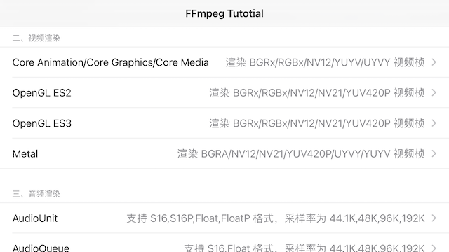
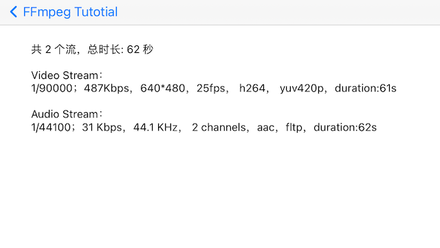
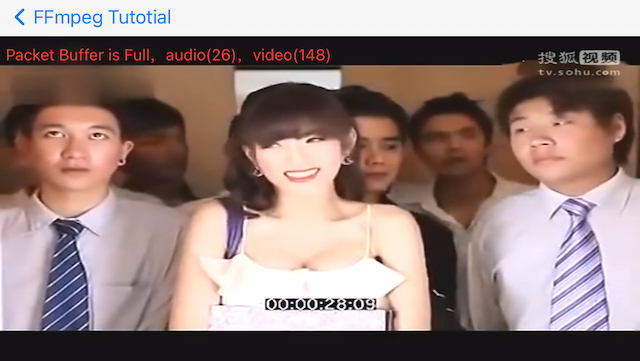
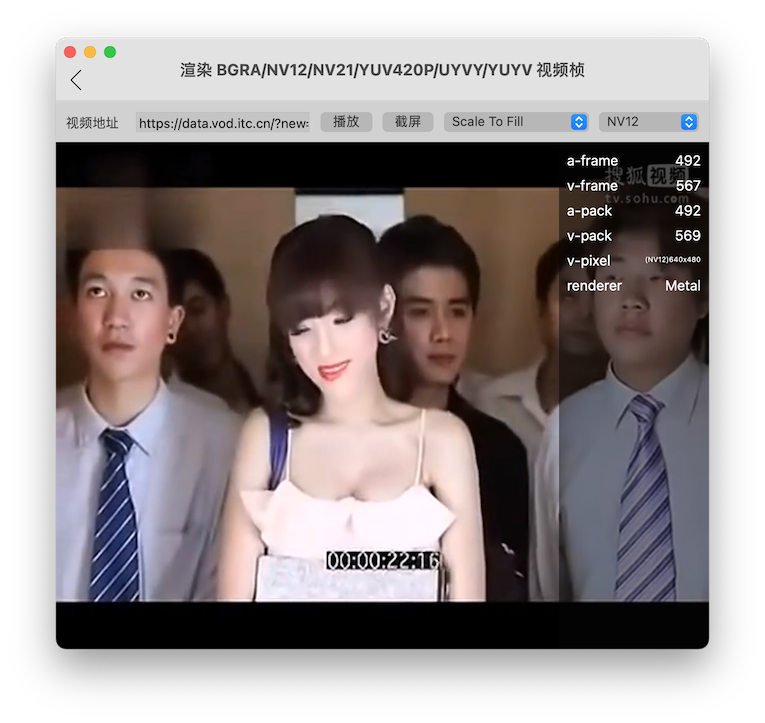
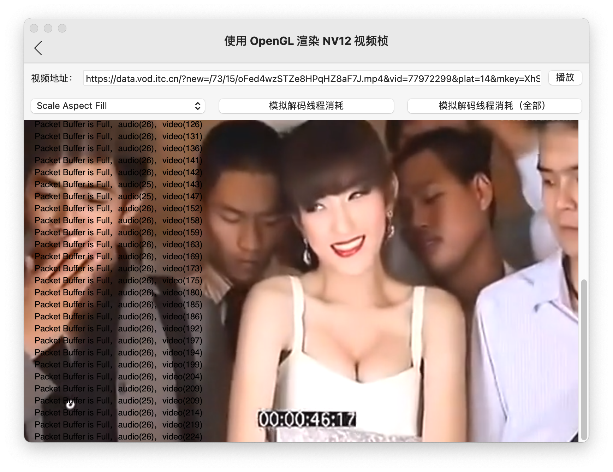
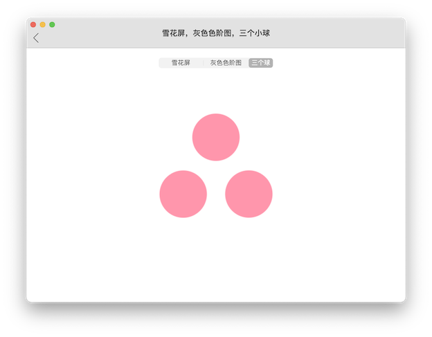

[](https://ffmpeg.org/) 

> 了解底层音视频技术是很有必要的，为了让更多零基础的 iOS/macOS 开发人员少走弯路，我编写了这个使用 FFmpeg 封装播放器系列教程，非常适合零基础的 iOS/macOS 开发者学习。 
> 
> 喜欢的老铁给个 Star 吧（先别着急 fork，现阶段会经常更新）。

[](https://github.com/debugly/FFmpegTutorial/stargazers)

# Usage

#### 1、运行 iOS 示例工程:

```bash
git clone https://github.com/debugly/FFmpegTutorial.git
cd FFmpegTutorial/Example/iOS
pod install
open FFmpegTutorial-iOS.xcworkspace
```

运行效果:







#### 2、运行 macOS 示例工程:

```bash
git clone https://github.com/debugly/FFmpegTutorial.git
cd FFmpegTutorial/Example/macOS
pod install
open FFmpegTutorial-macOS.xcworkspace
```








# Introduction

为方便管理依赖，项目使用 Pod 开发库（Development Pod）的形式来组织，所有对 FFmpeg 的封装代码都放在 FFmpegTutorial 库里，如何编译 FFmpeg 不是本教程的重点，因此我把编译好的 FFmpeg 库也做成了 Pod 库，编译 FFmpeg 等库的脚本在这里开源 [MRFFmpegPod](https://github.com/debugly/MRFFToolChainPod)。

教程提供了 iOS 和 macOS 的上层调用示例，开发语言为 Objective-C，工程目录结构如下:

```
├── Example
│   ├── iOS //iOS 示例工程
│   │   ├── FFmpegTutorial-iOS
│   │   ├── FFmpegTutorial-iOS.xcodeproj
│   │   ├── FFmpegTutorial-iOS.xcworkspace
│   │   ...
│   └── macOS //macOS 示例工程
│       ├── FFmpegTutorial-macOS
│       ├── FFmpegTutorial-macOS.xcodeproj
│       ├── FFmpegTutorial-macOS.xcworkspace
│       ...
├── FFmpegTutorial //对 FFmpeg 的封装
│   └── Classes
│       ├── 0x01  //查看编译时配置信息、支持的协议、版本号
│       ├── ...
│       └── common //通用类
├── FFmpegTutorial.podspec
└── md  //教程配套文档        
```

# FFmpegTutorial

教程共分为六个部分，其中第六部分是独立的仓库:

一、音视频基础

- 0x00:FFmpeg简介及编译方法
- 0x01:查看编译时配置信息、支持的协议、版本号;OpengGL信息
- 0x02:封装 NSThread，方便后续调用
- 0x03:查看音视频流信息
- 0x04:读取音视频包
- 0x05:音视频解码
- 0x06:抽取解码类，封装解码逻辑

二、视频渲染

- 0x10:封装视频缩放类，方便转出指定的像素格式
- 0x11:使用 Core Graphics 渲染视频帧
- 0x12:使用 Core Image 渲染视频帧
- 0x13:使用 Core Media 渲染视频帧
- 0x14:使用 OpenGL 渲染 BGRA 视频帧
  - 0x14-1:抽取 OpenGLCompiler 类，封装 OpenGL Shader 相关逻辑
  - 0x14-2:渲染 NV12
  - 0x14-3:渲染 NV21
  - 0x14-4:渲染 YUV420P
  - 0x14-5:渲染 UYVY422（Mac Only）
  - 0x14-6:渲染 YUYV422（Mac Only）
- 0x15:使用 OpenGL 3.2 / ES3 渲染视频帧
  - 0x15-1:渲染 BGRA 视频桢
  - 0x15-2:渲染 NV12
  - 0x15-3:渲染 NV21
  - 0x15-4:渲染 YUV420P
  - 0x15-5:渲染 UYVY422（Mac Only）
  - 0x15-6:渲染 YUYV422（Mac Only）
  - 0x15-7:截屏：使用 FBO 离屏渲染（Mac Only）
- 0x16:使用 OpenGL 3.2 + 矩形纹理 渲染视频帧（Mac Only）
  - 0x16-1:使用矩形纹理渲染 BGRA 视频桢
  - 0x16-2:使用矩形纹理渲染 NV12 视频桢
  - 0x16-3:使用矩形纹理渲染 NV21 视频桢
  - 0x16-4:使用矩形纹理渲染 YUV420P 视频桢
  - 0x16-5:使用矩形纹理渲染 UYVY422 视频桢
  - 0x16-6:使用矩形纹理渲染 YUYV422 视频桢
  - 0x16-7:使用矩形纹理渲染 NV12 视频桢+截屏
- 0x17:使用 Metal 渲染视频桢（TODO）

三、音频渲染

- 0x20:封装音频重采样类，方便转出指定的采样格式
- 0x21:使用 AudioUnit 渲染音频桢，声音断断续续的（支持 S16、S16P、FLT、FLTP）
- 0x22:增加AudioFrame缓存队列，解决断断续续问题
- 0x23:使用 AudioQueue 渲染音频桢（支持 S16、FLT）
- 0x24:抽取 AudioRenderer 类，封装底层音频渲染逻辑

四、封装播放器

- 0x30:增加 VideoFrame 缓存队列，不再阻塞解码线程
- 0x31:增加 AVPacket 缓存队列，创建解码线程
- 0x32:创建视频渲染线程，将视频相关逻辑封装到播放器内
- 0x33:将音频相关逻辑封装到播放器内
- 0x34:显示音视频播放进度
- 0x35:音视频同步
- 0x36:开始，结束，暂停，续播
- 0x37:(TODO)使用硬件加速解码
- 0x38:(TODO)使用将硬件解码数据快速上传至矩形纹理，避免拷贝解码数据
- 0x39:(TODO)两种方式将软解解码数据格式封装成 CVPixelBuffer
- 0x3a:(TODO)统一软硬解渲染逻辑
- 0x3b:(TODO)支持 Seek
- 0x3c:(TODO)支持从指定位置处播放
- 0x40:iOS和Mac公用一套渲染逻辑（TODO）

五、趣味实验

- 0x50:黑白电视机雪花屏、灰色色阶图

六、实用工具

- 高效视频抽帧器:[MRVideoToPicture](https://github.com/debugly/MRVideoToPicture)

# Cross-Platform

本教程的终极目标是写一款跨平台播放器，考虑到这是一项庞大的工程，本教程仅实现最基础的功能。

完整的播放器功能则在 B 站开源的 ijkplayer 之上进行二次开发，我已经从 iOS 平台移植到了 macOS 平台 : [ijkplayer](https://github.com/debugly/ijkplayer) ，增加了字幕、视频旋转等功能，最主要的是重构了视频渲染逻辑，值得一看！

## Ends

- Please give me an issue or a star or pull request！
- New members are always welcome!

Good Luck,Thank you！
