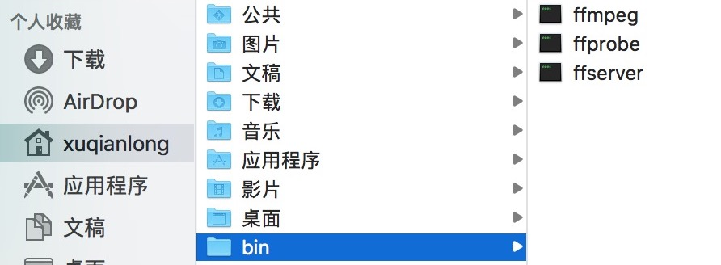

## FFmpeg 相关地址

- [官网 : http://www.ffmpeg.org/](http://www.ffmpeg.org/) 
- [官网 relese 包下载列表 : http://www.ffmpeg.org/releases/](http://www.ffmpeg.org/releases/) 
- [源码地址 : https://github.com/FFmpeg/FFmpeg](https://github.com/FFmpeg/FFmpeg)
- [iOS/macOS 平台一键编译脚本 : https://github.com/debugly/MRFFToolChainBuildShell](https://github.com/debugly/MRFFToolChainBuildShell)

## FFmpeg 的编译

如果你有过编译过 GNU 软件的话，那么编译 FFmpeg 就会容易些，因为它们都是一样的步骤，提供了一个叫 configure 的脚本来做编译前的个性化定制，允许对软件进行裁剪，以及通过对目标运行系统和平台的配置来决定软件本身采取的相关配置和策略等。

在成功 configure 之后，将会得到 config.mk 和 config.h 这两个文件；config.mk 对 makefile 起作用确定了编译的相关配置，而 config.h 里面基本是一堆宏定义，然而不同的平台或者 configure 时指定了参数就会导致 config.h 里面宏的值不同，最终达到对软件的自由裁剪和多平台的支持。

configure 脚本支持了哪些选项呢？可以在运行这个脚本时加上 --help 去查看，最常用的恐怕是 prefix 参数了，这个决定了编译好之后将库安装到那里。如果你留意观察的话，你会发现有这么几个选项：

```
--disable-ffmpeg
--disable-ffplay
--disable-ffprobe
--disable-ffserver
```

这几个是禁止生成对应可执行程序的，如果是编译 Mac 平台的 FFmpeg 库那你可以选择 enable ，然后生成的可执行程序就可以在命令行里直接运行使用相应的功能了！

# 编译 iOS 平台的 FFmpeg 库

如果前几年就开始使用 FFmpeg 的话，那时候还是 2.x 的版本，这个库一直在更新着，现在已经是 4.x 了，并且 API 有不少改动，比如 3.x 的解码方法跟 2.x 就完全不一样，为了能够更加全面的了解 FFmpeg ，因此前面的几篇基础教程都使用 3.x 版本库，等基本流程搞清楚之后，再升级到 4.x 版本，算是对过去版本也有个了解。

有了我准备好的[编译脚本](https://github.com/debugly/MRFFToolChainBuildShell)，正常来讲是可以正确编译出 FFmpeg 库的，不过这个过程比较耗时，我们宝贵的时间不应该浪费在编译库上，而是放在如何使用上！为了方便大家使用，我不仅编译好了库，而且做成了 Pod  库，使用起来很是方便！

- install MRFFmpeg4.2.2

```
pod 'MRFFmpegPod', :podspec => 'https://raw.githubusercontent.com/debugly/MRFFToolChainPod/master/MRFFmpeg4.2.2.podspec'
```

- install MRFFmpeg3.4.7

```
pod 'MRFFmpegPod', :podspec => 'https://raw.githubusercontent.com/debugly/MRFFToolChainPod/master/MRFFmpeg3.4.7.podspec'
```


# Mac 安装 FFMpeg 命令行工具

可以直接到官网下载编译好的可执行文件，为日后封装 iOS 版播放器提供帮助，比如查看视频的相关信息，确定 audio streamid，audio video streamid 等，这些都是很有帮助的！

注: 这里说的 Mac 平台的 FFMpeg 实际上是指的一套工具 ffmpeg,ffprobe,ffserver,ffpaly等，跟上面说的 iOS 平台的 FFmpeg 库不是一回事，iOS 平台上不能去执行其他可执行文件了，因此大部分情况下去编译这套工具没有太大意义！所以无特殊说明下，以后所提到的 FFMpeg 是 libavcodec、libavdevice、libavfilter、libavformat、libavutil、libswresample、libswscale 这几个库的统称，我们利用这些库去实现我们的播放器！当然了 Mac 平台的这套 FFMpeg 工具库也是基于这几个 lib 实现，有兴趣可以到源码中去查看！

## 下载库

官网已经为你编译好了 Mac 平台的库，可以直接下载把玩：[https://ffmpeg.org/download.html](https://ffmpeg.org/download.html)

也可以自行编译：[https://trac.ffmpeg.org/wiki/CompilationGuide/macOS](https://trac.ffmpeg.org/wiki/CompilationGuide/macOS)

## 配置 path

- 将下载好的库解压，然后将 [ffmpeg/bin](./ffmpeg/bin) 目录复制到 macOS 的用户主目录，即个人 Home 目录下



- 将 ~/bin 目录配置到 PATH 路径里，以便使用终端可以找到相应命令

```
//使用vi编辑器打开
vi ~/.profile
//输入 i 开始编辑，这是编辑之前的
export PATH="$PATH:$HOME/.rvm/bin"
//":" 是PATH连接符号，修改为
export PATH="$PATH:$HOME/.rvm/bin:$HOME/bin"
//如下步骤保存并退出:
esc ， shift+; ，wq
//刚才新加的PATH并没生效，需要重新开窗口或者：
source ~/.profile
```

以上步骤执行无误的话，可以查看下版本：

`bogon:~ xuqianlong$ ffmpeg -version`

```shell
ffmpeg version 3.3 Copyright (c) 2000-2017 the FFmpeg developers
built with llvm-gcc 4.2.1 (LLVM build 2336.11.00)
configuration: --prefix=/Volumes/Ramdisk/sw --enable-gpl --enable-pthreads --enable-version3 --enable-libspeex --enable-libvpx --disable-decoder=libvpx --enable-libmp3lame --enable-libtheora --enable-libvorbis --enable-libx264 --enable-avfilter --enable-libopencore_amrwb --enable-libopencore_amrnb --enable-filters --enable-libgsm --enable-libvidstab --enable-libx265 --disable-doc --arch=x86_64 --enable-runtime-cpudetect
libavutil      55. 58.100 / 55. 58.100
libavcodec     57. 89.100 / 57. 89.100
libavformat    57. 71.100 / 57. 71.100
libavdevice    57.  6.100 / 57.  6.100
libavfilter     6. 82.100 /  6. 82.100
libswscale      4.  6.100 /  4.  6.100
libswresample   2.  7.100 /  2.  7.100
libpostproc    54.  5.100 / 54.  5.100
```

## ffmpeg 使用手册

1.通用选项

```
-L license
-h 帮助
-fromats 显示可用的格式，编解码的，协议的...
-f fmt 强迫采用格式fmt
-I filename 输入文件
-y 覆盖输出文件
-t duration 设置纪录时间 hh:mm:ss[.xxx]格式的记录时间也支持
-ss position 搜索到指定的时间 [-]hh:mm:ss[.xxx]的格式也支持
-title string 设置标题
-author string 设置作者
-copyright string 设置版权
-comment string 设置评论
-target type 设置目标文件类型(vcd,svcd,dvd) 所有的格式选项（比特率，编解码以及缓冲区大小）自动设置，只需要输入如下的就可以了：ffmpeg -i myfile.avi -target vcd /tmp/vcd.mpg
-hq 激活高质量设置
-itsoffset offset 设置以秒为基准的时间偏移，该选项影响所有后面的输入文件。该偏移被加到输入文件的时戳，定义一个正偏移意味着相应的流被延迟了 offset秒。 [-]hh:mm:ss[.xxx]的格式也支持
```

2.视频选项

```
-b bitrate 设置比特率，缺省200kb/s
-r fps 设置帧频 缺省25
-s size 设置帧大小 格式为WXH 缺省160X128.下面的简写也可以直接使用：
Sqcif 128X96 qcif 176X144 cif 252X288 4cif 704X576
-aspect aspect 设置横纵比 4:3 16:9 或 1.3333 1.7777
-croptop size 设置顶部切除带大小 像素单位
-cropbottom size –cropleft size –cropright size
-padtop size 设置顶部补齐的大小 像素单位
-padbottom size –padleft size –padright size –padcolor color 设置补齐条颜色(hex,6个16进制的数，红:绿:兰排列，比如 000000代表黑色)
-vn 不做视频记录
-bt tolerance 设置视频码率容忍度kbit/s
-maxrate bitrate设置最大视频码率容忍度
-minrate bitreate 设置最小视频码率容忍度
-bufsize size 设置码率控制缓冲区大小
-vcodec codec 强制使用codec编解码方式。如果用copy表示原始编解码数据必须被拷贝。
-sameq 使用同样视频质量作为源（VBR）
-pass n 选择处理遍数（1或者2）。两遍编码非常有用。第一遍生成统计信息，第二遍生成精确的请求的码率
-passlogfile file 选择两遍的纪录文件名为file
```

3.高级视频选项

```
-g gop_size 设置图像组大小
-intra 仅适用帧内编码
-qscale q 使用固定的视频量化标度(VBR)
-qmin q 最小视频量化标度(VBR)
-qmax q 最大视频量化标度(VBR)
-qdiff q 量化标度间最大偏差 (VBR)
-qblur blur 视频量化标度柔化(VBR)
-qcomp compression 视频量化标度压缩(VBR)
-rc_init_cplx complexity 一遍编码的初始复杂度
-b_qfactor factor 在p和b帧间的qp因子
-i_qfactor factor 在p和i帧间的qp因子
-b_qoffset offset 在p和b帧间的qp偏差
-i_qoffset offset 在p和i帧间的qp偏差
-rc_eq equation 设置码率控制方程 默认tex^qComp
-rc_override override 特定间隔下的速率控制重载
-me method 设置运动估计的方法 可用方法有 zero phods log x1 epzs(缺省) full
-dct_algo algo 设置dct的算法 可用的有 0 FF_DCT_AUTO 缺省的DCT 1 FF_DCT_FASTINT 2 FF_DCT_INT 3 FF_DCT_MMX 4 FF_DCT_MLIB 5 FF_DCT_ALTIVEC
-idct_algo algo 设置idct算法。可用的有 0 FF_IDCT_AUTO 缺省的IDCT 1 FF_IDCT_INT 2 FF_IDCT_SIMPLE 3 FF_IDCT_SIMPLEMMX 4 FF_IDCT_LIBMPEG2MMX 5 FF_IDCT_PS2 6 FF_IDCT_MLIB 7 FF_IDCT_ARM 8 FF_IDCT_ALTIVEC 9 FF_IDCT_SH4 10 FF_IDCT_SIMPLEARM
-er n 设置错误残留为n 1 FF_ER_CAREFULL 缺省 2 FF_ER_COMPLIANT 3 FF_ER_AGGRESSIVE 4 FF_ER_VERY_AGGRESSIVE
-ec bit_mask 设置错误掩蔽为bit_mask,该值为如下值的位掩码 1 FF_EC_GUESS_MVS (default=enabled) 2 FF_EC_DEBLOCK (default=enabled)
-bf frames 使用frames B 帧，支持mpeg1,mpeg2,mpeg4
-mbd mode 宏块决策 0 FF_MB_DECISION_SIMPLE 使用mb_cmp 1 FF_MB_DECISION_BITS 2 FF_MB_DECISION_RD
-4mv 使用4个运动矢量 仅用于mpeg4
-part 使用数据划分 仅用于mpeg4
-bug param 绕过没有被自动监测到编码器的问题
-strict strictness 跟标准的严格性
-aic 使能高级帧内编码 h263+
-umv 使能无限运动矢量 h263+
-deinterlace 不采用交织方法
-interlace 强迫交织法编码仅对mpeg2和mpeg4有效。当你的输入是交织的并且你想要保持交织以最小图像损失的时候采用该选项。可选的方法是不交织，但是损失更大
-psnr 计算压缩帧的psnr
-vstats 输出视频编码统计到vstats_hhmmss.log
-vhook module 插入视频处理模块 module 包括了模块名和参数，用空格分开
```

4.音频选项

```
-ab bitrate 设置音频码率
-ar freq 设置音频采样率
-ac channels 设置通道 缺省为1
-an 不使能音频纪录
-acodec codec 使用codec编解码
```

5.音频/视频捕获选项

```
-vd device 设置视频捕获设备。比如/dev/video0
-vc channel 设置视频捕获通道 DV1394专用
-tvstd standard 设置电视标准 NTSC PAL(SECAM)
-dv1394 设置DV1394捕获
-av device 设置音频设备 比如/dev/dsp
```

6.高级选项

```
-map file:stream 设置输入流映射
-debug 打印特定调试信息
-benchmark 为基准测试加入时间
-hex 倾倒每一个输入包
-bitexact 仅使用位精确算法 用于编解码测试
-ps size 设置包大小，以bits为单位
-re 以本地帧频读数据，主要用于模拟捕获设备
-loop 循环输入流（只工作于图像流，用于ffserver测试）
```

7.使用 ffmpeg 转码的简单例子

```c
ffmpeg -i ~/Desktop/ffmpeg-test/uglybetty.mp4 ~/Desktop/ffmpeg-test/ugly.mov
``` 

- [详细官方英文手册](http://ffmpeg.org/ffmpeg.html)
- 更多的参数含义可查看 [雷霄骅博客](http://blog.csdn.net/leixiaohua1020/article/details/12751349).
 
 
## ffprobe 使用手册

- 使用 ffprobe 查看视频格式信息
 
```c
ffprobe ugly.mov 
ffprobe version 3.3 Copyright (c) 2007-2017 the FFmpeg developers
built with llvm-gcc 4.2.1 (LLVM build 2336.11.00)
configuration: --prefix=/Volumes/Ramdisk/sw --enable-gpl --enable-pthreads --enable-version3 --enable-libspeex --enable-libvpx --disable-decoder=libvpx --enable-libmp3lame --enable-libtheora --enable-libvorbis --enable-libx264 --enable-avfilter --enable-libopencore_amrwb --enable-libopencore_amrnb --enable-filters --enable-libgsm --enable-libvidstab --enable-libx265 --disable-doc --arch=x86_64 --enable-runtime-cpudetect
libavutil      55. 58.100 / 55. 58.100
libavcodec     57. 89.100 / 57. 89.100
libavformat    57. 71.100 / 57. 71.100
libavdevice    57.  6.100 / 57.  6.100
libavfilter     6. 82.100 /  6. 82.100
libswscale      4.  6.100 /  4.  6.100
libswresample   2.  7.100 /  2.  7.100
libpostproc    54.  5.100 / 54.  5.100
Input #0, mov,mp4,m4a,3gp,3g2,mj2, from 'ugly.mov':
Metadata:
major_brand     : qt  
minor_version   : 512
compatible_brands: qt  
encoder         : Lavf57.71.100
Duration: 00:04:57.71, start: 0.000000, bitrate: 483 kb/s
Stream #0:0(eng): Video: h264 (High) (avc1 / 0x31637661), yuv420p, 608x336 [SAR 1:1 DAR 38:21], 347 kb/s, 24 fps, 24 tbr, 12288 tbn, 48 tbc (default)
Metadata:
  handler_name    : DataHandler
  encoder         : Lavc57.89.100 libx264
Stream #0:1(eng): Audio: aac (LC) (mp4a / 0x6134706D), 44100 Hz, stereo, fltp, 129 kb/s (default)
Metadata:
  handler_name    : DataHandler

```