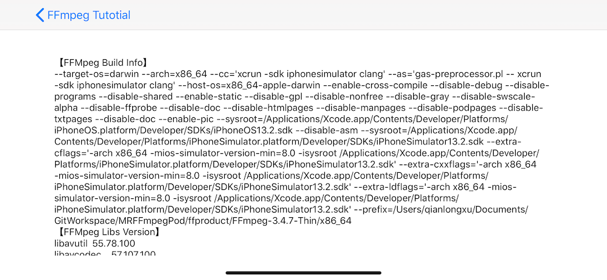

## 效果图



## 获取库版本号

MRFFmpegPod 共包括 FFmpeg 的了 7 个库，每个库都有一个 version 头文件，每个头文件里都有个宏来定义该库的版本号，因此导入头文件后，我们就能获取到版本号了。

```objc
#include <libavutil/version.h>
#include <libavcodec/version.h>
#include <libavformat/version.h>
#include <libavdevice/version.h>
#include <libavfilter/version.h>
#include <libswscale/version.h>
#include <libswresample/version.h>
```

不过接下来的问题是如何使用这个版本号，因为各个头文件里定义的都是个宏，宏本身是不包含类型信息的，这里宏解开后最终拿到的是一个使用 . 来分割的“数字串”，并非 C 语言的字符串哦，因此不能直接用，对此我专门写了个直接转成 OC 字符串的宏:

```
#define STRINGME_(x)    #x
#define STRINGME(x)     STRINGME_(x)
#define STRINGME2OC(x)  @STRINGME(x)
```

有了这个宏就好办了，比如获取 libavutil 的版本号，就可以这么写了:

`STRINGME2OC(LIBAVUTIL_VERSION)`


## 获取编译时的配置

这 7 个库是编译成功的产物，每个库的头文件里都提供了对应的方法去获取编译时配置信息，因为通常不会分开去编译这些库，都是一起编译的，所以我们随便选择一个库的编译配置就行了，因为都是一样的。

比如，获取 libavcodec 的编译配置，可以通过 avcodec_configuration() 方法，该方法在 <libavcodec/avcodec.h> 头文件里。

## 查看支持的协议

libavformat 库是最重要的库之一，它封装了 Protocol 层和 Demuxer、Muxer 层，开发者无需关注内部实现，直接调用即可。

因此要查看支持的协议就要找 libavformat 库，在 avformat.h 头文件里有个 avio_enum_protocols 方法可以获取输入输出流支持的协议。

有了这个协议列表后，我们就能知道我们编译好的库能播那些协议的视频了，目前我编译好的库是不支持 https 流的，这个读者可以自行验证下。
