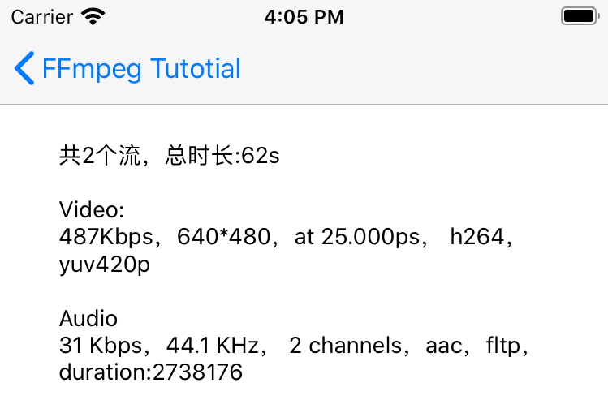

## 查看视频流基础信息



## 实现步骤

要想查看视频流基础信息，就必须先打开流，这一过程牵涉到网络或者磁盘 IO ，因此使用独立线程完成比较合适。在 iOS 里我们可以使用 NSThread 来开启一个新线程。


### 用到的头文件

```c
#include <libavformat/avformat.h>
#import <libavutil/pixdesc.h>
```

### 用到的方法

|方法名|作用|
| -------------------------------- | ------------------------------------------------------------ |
| av_log_set_level(AV_LOG_VERBOSE) | 设置日志级别，找不到问题时可以打开信息日志，只对av_log_default_callback有效 |
| av_register_all()                | 初始化 libavformat，注册所有的复用器，解复用器，协议协议；   |
| avformat_network_init() | 初始化网络模块，本地视频可以不调用，网络视频必须调用； |
| avformat_open_input() | 打开文件流，读取头信息；函数将获取的信息放到 AVFormatContext *formatCtx 中，后续通过该 formatCtx 获取我们需要的信息 |
| avformat_find_stream_info() | 读包获取流信息，避免诸如MPEG-2之类的格式没有头信息，获取不是视频信息； |
| av_dump_format() | 用于查看详细信息，调试的时候打出来看下很有必要 |
| avformat_close_input() | 关闭流，跟open相配对； |

### 核心代码：

1、 创建线程（此时并没有开始工作，处于read状态）

```objc
///读包线程
@property (nonatomic, strong) NSThread *readThread;

///准备
- (void)prepareToPlay
{
    if (self.readThread) {
        NSAssert(NO, @"不允许重复创建");
    }
    
    ///初始化ffmpeg相关函数
    init_ffmpeg_once();
    
    ///避免NSThread和self相互持有，外部释放self时，NSThread延长self的生命周期，带来副作用！
    MRRWeakProxy *weakProxy = [MRRWeakProxy weakProxyWithTarget:self];
    ///不允许重复准备
    self.readThread = [[NSThread alloc] initWithTarget:weakProxy selector:@selector(readPacketsFunc) object:nil];
}

```

2、线程开始

```objc
[self.readThread start];
```

3、取消

```objc
- (void)_stop
{
    [self.readThread cancel];
    self.readThread = nil;
}
```

4、子线程读包逻辑

```objc
- (void)readPacketsFunc
{
	///取消了就直接返回，不再处理
    if ([[NSThread currentThread] isCancelled]) {
        return;
    }
    if ([[NSThread currentThread] isCancelled]) {
        return;
    }
    
    NSParameterAssert(self.contentPath);
    /// iOS 子线程需要显式创建 autoreleasepool 以释放 autorelease 对象
    @autoreleasepool {
        
        [[NSThread currentThread] setName:@"readPacket"];
        
        if (![self.contentPath hasPrefix:@"/"]) {
            _init_net_work_once();
        }
        
        AVFormatContext *formatCtx = NULL;
        /*
         打开输入流，读取文件头信息，不会打开解码器；
         */
        ///低版本是 av_open_input_file 方法
        const char *moviePath = [self.contentPath cStringUsingEncoding:NSUTF8StringEncoding];
        
        //打开文件流，读取头信息；
        if (0 != avformat_open_input(&formatCtx, moviePath , NULL, NULL)) {
            ///关闭，释放内存，置空
            avformat_close_input(&formatCtx);
            self.error = _make_nserror_desc(FFPlayerErrorCode_OpenFileFailed, @"文件打开失败！");
            [self performResultOnMainThread:nil];
        } else {
         
            /* 刚才只是打开了文件，检测了下文件头而已，并不知道流信息；因此开始读包以获取流信息
             设置读包探测大小和最大时长，避免读太多的包！
             */
            formatCtx->probesize = 500 * 1024;
            formatCtx->max_analyze_duration = 5 * AV_TIME_BASE;
    #if DEBUG
            NSTimeInterval begin = [[NSDate date] timeIntervalSinceReferenceDate];
    #endif
            if (0 != avformat_find_stream_info(formatCtx, NULL)) {
                avformat_close_input(&formatCtx);
                self.error = _make_nserror_desc(FFPlayerErrorCode_StreamNotFound, @"不能找到流！");
                [self performResultOnMainThread:nil];
            } else {
    #if DEBUG
                NSTimeInterval end = [[NSDate date] timeIntervalSinceReferenceDate];
                ///用于查看详细信息，调试的时候打出来看下很有必要
                av_dump_format(formatCtx, 0, moviePath, false);
                
                NSLog(@"avformat_find_stream_info coast time:%g",end-begin);
    #endif
                /* 接下来，尝试找到我们关心的信息*/
                NSMutableString *text = [[NSMutableString alloc]init];
                
                /*AVFormatContext 的 streams 变量是个数组，里面存放了 nb_streams 个元素，每个元素都是一个 AVStream */
                [text appendFormat:@"共%u个流，总时长:%llds",formatCtx->nb_streams,formatCtx->duration/AV_TIME_BASE];
                //遍历所有的流
                for (NSInteger i = 0; i < formatCtx->nb_streams; i++) {
                    
                    AVStream *stream = formatCtx->streams[i];
                    
                    AVCodecContext *codecCtx = avcodec_alloc_context3(NULL);
                    if (!codecCtx){
                        continue;
                    }
                    
                    int ret = avcodec_parameters_to_context(codecCtx, stream->codecpar);
                    if (ret < 0){
                        avcodec_free_context(&codecCtx);
                        continue;
                    }
                    
                    av_codec_set_pkt_timebase(codecCtx, stream->time_base);
                    
                    //AVCodecContext *codec = stream->codec;
                    enum AVMediaType codec_type = codecCtx->codec_type;
                    switch (codec_type) {
                            ///音频流
                        case AVMEDIA_TYPE_AUDIO:
                        {
                            //采样率
                            int sample_rate = codecCtx->sample_rate;
                            //声道数
                            int channels = codecCtx->channels;
                            //平均比特率
                            int64_t brate = codecCtx->bit_rate;
                            //时长
                            int64_t duration = stream->duration;
                            //解码器id
                            enum AVCodecID codecID = codecCtx->codec_id;
                            //根据解码器id找到对应名称
                            const char *codecDesc = avcodec_get_name(codecID);
                            //音频采样格式
                            enum AVSampleFormat format = codecCtx->sample_fmt;
                            //获取音频采样格式名称
                            const char * formatDesc = av_get_sample_fmt_name(format);
                            
                            [text appendFormat:@"\n\nAudio\n%d Kbps，%.1f KHz， %d channels，%s，%s，duration:%lld",(int)(brate/1000.0),sample_rate/1000.0,channels,codecDesc,formatDesc,duration];
                        }
                            break;
                            ///视频流
                        case AVMEDIA_TYPE_VIDEO:
                        {
                            ///画面宽度，单位像素
                            int vwidth = codecCtx->width;
                            ///画面高度，单位像素
                            int vheight = codecCtx->height;
                            //比特率
                            int64_t brate = codecCtx->bit_rate;
                            //解码器id
                            enum AVCodecID codecID = codecCtx->codec_id;
                            //根据解码器id找到对应名称
                            const char *codecDesc = avcodec_get_name(codecID);
                            //视频像素格式
                            enum AVPixelFormat format = codecCtx->pix_fmt;
                            //获取视频像素格式名称
                            const char * formatDesc = av_get_pix_fmt_name(format);
                            ///帧率
                            CGFloat fps, timebase = 0.04;
                            if (stream->time_base.den && stream->time_base.num) {
                                timebase = av_q2d(stream->time_base);
                            }
                            
                            if (stream->avg_frame_rate.den && stream->avg_frame_rate.num) {
                                fps = av_q2d(stream->avg_frame_rate);
                            }else if (stream->r_frame_rate.den && stream->r_frame_rate.num){
                                fps = av_q2d(stream->r_frame_rate);
                            }else{
                                fps = 1.0 / timebase;
                            }
                            
                            [text appendFormat:@"\n\nVideo:\n%dKbps，%d*%d，at %.3fps， %s， %s",(int)(brate/1024.0),vwidth,vheight,fps,codecDesc,formatDesc];
                        }
                            break;
                        case AVMEDIA_TYPE_ATTACHMENT:
                        {
                            NSLog(@"附加信息流:%ld",i);
                        }
                            break;
                        default:
                        {
                            NSLog(@"其他流:%ld",i);
                        }
                            break;
                    }
                    
                    avcodec_free_context(&codecCtx);
                }
                //关闭流
                avformat_close_input(&formatCtx);
                [self performResultOnMainThread:text];
            }
        }
    }
}
```
